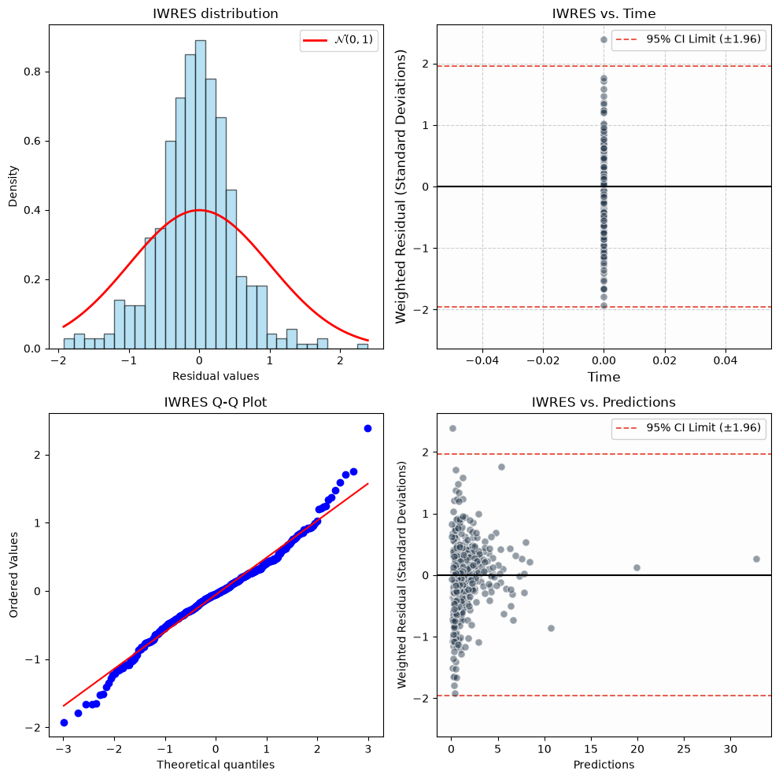
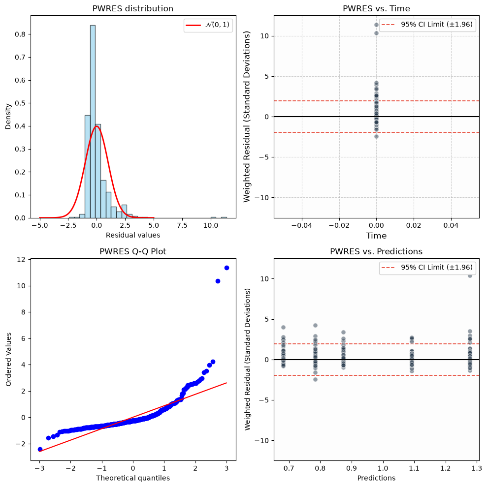
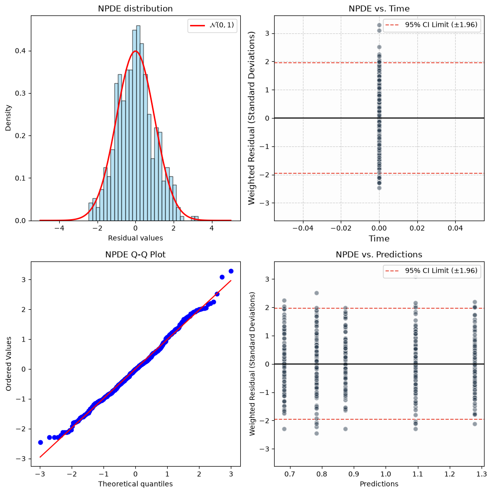
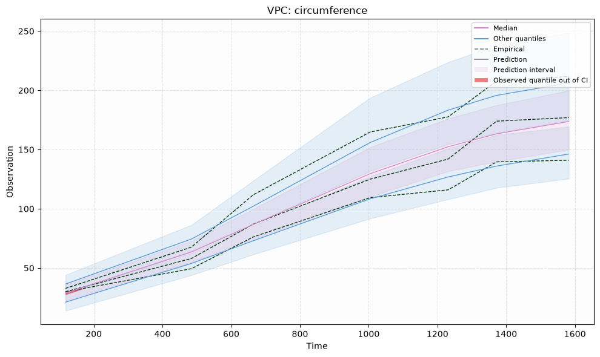

# Diagnostics

These diagnostics assess the fit of the structural model, residual error model, and individual variability.

Notation follows the [NLME model documentation](./nlme_model.md): 

  * $y_{ij}$ is the observation for patient $i$ at time $t_{ij}$
  * $f_{ij}$ or $f(\theta_i, t_{ij})$ is the corresponding model prediction
  * $\theta_i$ are the model parameters for patient $i$
  * $g(\theta_i, t_{ij})^2$ is the residual variance (_e.g._ $\sigma^2$ for an additive model)
  * $\eta_i \sim \mathcal N(0,\Omega)$ are the random effects

All diagnostics use the fitted population parameters, held fixed.

| Diagnostic | Checks | Expected if the model or data are adequate |
|---|---|---|
| IWRES | structural + error model, per patient | $\approx\mathcal N(0,1)$ when shrinkage is low |
| PWRES | population predictions + variability | mean $\approx 0$, variance $\approx 1$ |
| NPDE | full predictive distribution | $\approx\mathcal N(0,1)$ | 
| VPC | quantiles over time | observed within simulated bands | 
| Log-likelihood | overall fit (model comparison) | only relative to other models | 
| Shrinkage | informativeness of individual data | lower values support interpretation of individual estimates | 


## Individual Weighted Residuals (IWRES)

IWRES measure the discrepancy between observations and individual predictions, normalized by the residual standard deviation:

```math
\mathrm{IWRES}_{ij} = \frac{y_{ij}-f(\hat\theta_i,t_{ij})}{g(\hat\theta_i,t_{ij})}.
```

$\hat\theta_i$ is the approximate MAP: the highest-posterior sample the conditional sampler has visited.

An unbiased model should lead to residuals centered around zero.
The residuals do not have to follow a normal distribution, the $\mathcal N(0,1)$ in the plots is only a rough reference.



## Population Weighted Residuals (PWRES)

PWRES compare each patient's observations with the population predictive distribution.
Draw $K$ sets of random effects $\eta\sim\mathcal N(0,\Omega)$ (the default is $K=100$) and simulate each patient. For patient $i$:

```math
\mu_i=\mathbb E[f_i],\quad V_i=\operatorname{Cov}(f_i)+\operatorname{diag}\,\mathbb E[g_i^2],\quad L_iL_i^T=V_i,\quad
\mathrm{PWRES}_i=L_i^{-1}(y_i-\mu_i).
```
where the expectations and covariance are estimated from the $K$ simulations.


Subtracting $\mu_i$ and multiplying by $L_i^{-1}$ standardizes the residuals and removes the modeled within-patient correlation. 

The target is mean 0 and variance 1 but normality is not guaranteed for nonlinear models. 



## Normalized Prediction Distribution Errors (NPDE)

**NPDE** builds on the already computed **PWRES** and applies further transformations to target normality of the residuals.

Residual noise is added the simulations and the noisy simulations are transformed with the same $\mu_i$ and $L_i$:

```math
\tilde z^{(k)}_{ij} = L_i^{-1}(f_{i}^{(k)} + g_{i}^{(k)}\varepsilon_{i}^{(k)}-\mu_{i})
```

We compute the empirical CDF of the $z_{ij}$ evaluated at the observed $\mathrm{PWRES}_{ij}$ and
then apply the $\mathcal N (0, 1)$ inverse CDF:

```math
\mathrm{NPDE}_{ij}=\Phi^{-1}\Big(\tfrac1K\textstyle\sum_k \mathbf 1\{\tilde z^{(k)}_{ij}\le z_{ij}\}\Big)
```

If each observation is a realization of the simulated distribution, _i.e._ if the model is correct, these should 
be approximately standard normal.  

A shifted center indicates bias. Spread or tails that are off indicate misspecified variability.   
Note that probabilities are clipped to $[0.5/K,\,1-0.5/K]$, so small $K$ limits tail resolution.



## Visual Predictive Checks (VPC)

For each continuous output and each time bin, compare the observed quantiles with the median and interval of the same quantiles across simulated replicates. 
Simulations come from the fitted population distribution.
Each replicate preserves the observed study design and observation times, draws fresh population random effects, and adds residual noise.  
The bands show the variation of each sample quantile across simulations. The defaults are:
  * `quantiles = [0.05, 0.5, 0.95]`: 5th, 50th and 95th percentiles.
  * `precision = 0.95`: bands around each quantiles are central 90% simulation bands: lower bound is the 5th percentile, upper bound is the 95th (= the precision) percentile.


